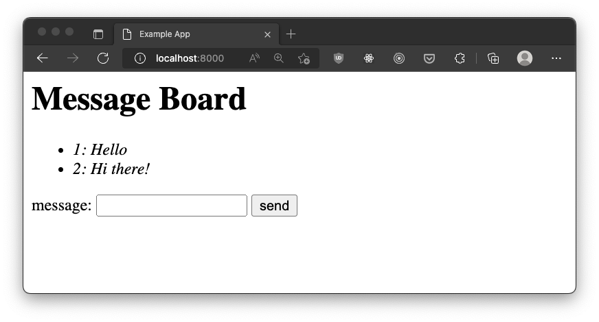

# Web Development Crash Course: Building a Message Board

Over the course of several videos, we'll be building an authenticated message board from scratch with
Express, Handlebars, and SQLite. This series is aimed at people who are familiar with programming but new to web development.

This series is based on a lecture I've given several times, including at Sunhacks 2020 and in Justin Selgrad's CPI310 class.

[Youtube playlist](https://www.youtube.com/playlist?list=PLo3AfLl5F0ZbTS8HrKhKy27bdcLIeLTYr)

## Videos

### 1. Intro
If you're new to web development, start here! We go over the basics of how to get a web app up and going with Node and Express 
#### Topics covered
- Project setup
- HTTP Requests
- HTML Forms
- Handlebars templates

[YouTube link](https://www.youtube.com/watch?v=X6aeuRNGPas&list=PLo3AfLl5F0ZbTS8HrKhKy27bdcLIeLTYr) (30:03)

### 2. Databases
In which we add a SQLite database to our message board to store our users' messages.
#### Topics covered
- ESModules
- Basic SQLite usage including reading, writing, and migrations
- Promises

[YouTube link](https://www.youtube.com/watch?v=qdV9S7UE99o&list=PLo3AfLl5F0ZbTS8HrKhKy27bdcLIeLTYr&index=2) (15:12)

### 3. User Registration
A proper user authentication system requires registering users, identifying their resources and actions, and allowing users to log in when they return to the site. This video is focused on registering users. 
#### Topics covered
- Using Nodemon
- Hashing passwords

[YouTube link](https://youtu.be/hw5y9cjBJ_A) (26:20)

### 4. Linking users and posts
Building on the registration system, we now associate each post with the user that posted it, and look up each of them when we retrieve the posts.
#### Topics covered
- Cookies
- SQL joins
- SQL Foreign Keys

(Planned)

### 5. User Login
Our previous video had a huge security flaw: any user could post as any other user! It's time to ask for passwords with a login form, and remember who they are with cookies.
#### Topics covered
- Comparing hashed passwords
- Authentication tokens and proper cookie usage
- Sessions

(Planned)

## The Future
What should I cover next? Hosting? Typescript? A React client?